  
  
  

  
  
  
  
  
  
  
  
  

 

## About Me

- 🎓 B.Tech CSE (AIML) at **The Neotia University** — CGPA 9.23
- 🤖 Aspiring **AI & ML Engineer** focused on intelligent, inclusive systems
- 💡 Hands-on with **Generative AI, Multi-Agent Systems, LLMs, and AI-powered automation**
- 📱 **Android developer** integrating on-device AI with TensorFlow Lite
- 🧾 Author of **2 research papers**, one presented at the **ISDSI Global Conference**
- 🏆 **10+ hackathons** and **2+ ideathons** across healthcare, education, and career-tech

 

## Featured Projects

<table>
<tr>
<td width="50%" valign="top">

### 🧠 Lumina+
**Inclusive AI-powered learning platform**

Accessibility-first education platform built with **Gemini API, Next.js, TypeScript, Vertex AI**. Adapts content for visually, hearing, and cognitively impaired learners with auto text simplification, captions, TTS narration, and personalized dashboards.

`Gemini API` `Next.js` `TypeScript` `Vertex AI`

</td>
<td width="50%" valign="top">

### 🎯 HireWise
**AI-powered candidate ranking system**

CPU-only pipeline built for a strict-time-budget hackathon with zero internet access at ranking time. Replaces per-candidate LLM calls with a fixed capability taxonomy scored via sentence-embedding cosine similarity, a single pre-clock LLM call for JD understanding, and FAISS-based multi-signal retrieval.

`FAISS` `Sentence Embeddings` `LLM Pipeline Design`

</td>
</tr>
<tr>
<td width="50%" valign="top">

### 🚨 SafeDrive
**Real-time accident detection & alert system**

Trained **YOLOv8** on a custom-annotated accident dataset (mAP@0.5 of 0.76), tested on live CCTV footage. Full alert pipeline: snapshot capture (OpenCV) → Cloudinary upload → Twilio SMS with location ID sent to police and hospital contacts.

`YOLOv8` `OpenCV` `Cloudinary` `Twilio`

</td>
<td width="50%" valign="top">

### 📱 SkinDiseaseCheck
**On-device dermatological diagnosis app**

Two-stage classifier — binary Disease/No-Disease gate followed by a 9-class disease model — built to cut false positives on healthy-skin images. **MobileNetV2**, quantized to **TFLite**, integrated into Android for fully offline inference at 84% validation accuracy.

`MobileNetV2` `TensorFlow Lite` `Android SDK`

</td>
</tr>
</table>

 

## Experience

**GenAI Intern — IIT Jammu**   `Jun 2025 – Jul 2025`
Built GenAI-based automation systems and multi-agent pipelines using **CrewAI, LangChain, Ollama, RAG**, and orchestration in **n8n**.

**Cybersecurity Intern — DataSpace Academy**   `Jun 2024 – Jul 2024`
Hands-on experience with **Burp Suite, Nessus, Metasploit**, and network penetration testing.

 

## Tech Stack

 

## GitHub Stats

 

<!---
Saswata-pal/Saswata-pal is a ✨ special ✨ repository because its `README.md` (this file) appears on your GitHub profile.
You can click the Preview link to take a look at your changes.
--->